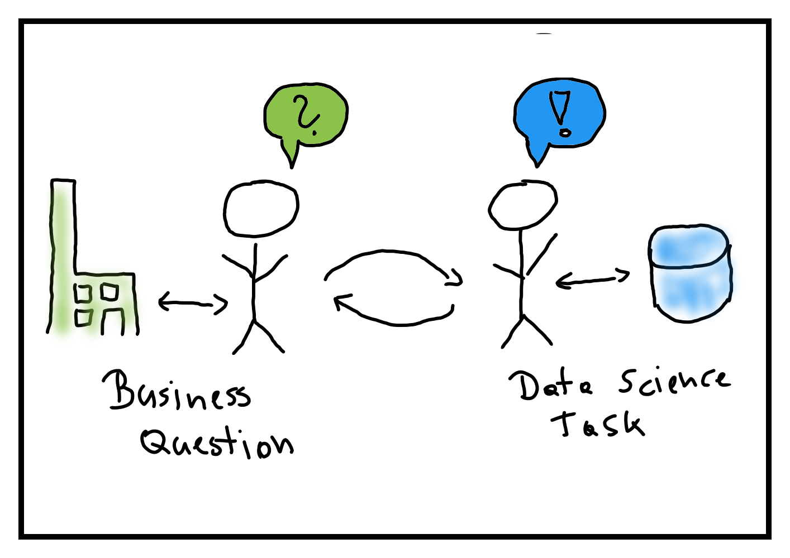
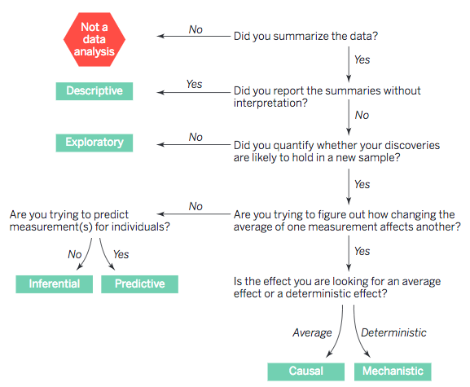

At the beginning of every analysis, there should be a question. In the
business world, it is a question typically related to
the business' operations, strategy, or products. As a data scientist,
my job is to translate the question into a data science task. 
Sounds simple---but is really crucial as the specific data science task
to be solved defines the conclusions that can be drawn from the data
and the analysis.

[I work](https://www.linkedin.com/in/mjaeugster/) in a *Data Analytics & Insights* unit,
in 
[my Meetup profile](https://www.meetup.com/4laendereck-Data-Science-Meetup/members/209552468/)
I state that *"I try to turn data into insights"* and in my working
day I often shout out that *"we need to create (actionable) insights and
be data-driven"* -- but what does this actually mean? This is the first 
part of my 
[Data Philosophy series](https://medium.com/@mjaeugster/data-philosophy-4522529ac213)
where I try to
dissect and understand what "*to turn data into insights*" actually 
means. 

# The six types of data science tasks

Jeffery T. Leek and Roger D. Peng define in 
"[*What is the Question?*](https://www.d.umn.edu/~kgilbert/ened5560-1/The%20Research%20Question-2015-Leek-1314-5.pdf)"
six types of data science tasks with increasing complexity:

In this post, I leave out the *Mechanistic* data science task as it is
rarely available in day-to-day data science questions and tasks (at least
in my daily work I never stumbled across it).

## Descriptive and Exploratory data analysis

> What is the number of active users per month?
>
> Is there a seasonal trend in the number of active users?

The first example question is a descriptive question. The goal is to get a
[summary of the existing data sample](https://en.wikipedia.org/wiki/Descriptive_statistics).
The second example question is an exploratory question, and the task is
to summarize, but also to explore potential correlations and trends. 
Often, its goal is to play with the data and formulate new ideas and 
hypotheses that potentially lead to new data collection and experiments.
Methods used in descriptive and exploratory tasks range from
[Five-number summaries](https://en.wikipedia.org/wiki/Five-number_summary)
to more sophisticated methods related to 
[Exploratory Data Analysis](https://en.wikipedia.org/wiki/Exploratory_data_analysis)
(highly promoted by [John Tukey](https://en.wikipedia.org/wiki/John_Tukey)).
For the example descriptive question we would compute, e.g., the 
[average](https://en.wikipedia.org/wiki/Average)
number of active users per month (maybe already with a 
[confidence interval](https://en.wikipedia.org/wiki/Confidence_interval)); 
for the example exploratory question we would start, e.g., with a
[time series plot](https://blog.socialcops.com/academy/resources/visualizing-time-series-data/).

## Inferential data analysis

> Is the user activity really different 
> between customers that bought the product in May vs. June?

In case of an inferential question, the task is to quantify whether an
observed pattern will likely hold beyond the existing data sample. 
[Statistical inference](https://en.wikipedia.org/wiki/Statistical_inference)
includes, e.g., [statistical hypothesis testing](https://en.wikipedia.org/wiki/Statistical_hypothesis_testing).
For the example question above, we could conduct a statistical test with the
[null hypothesis](https://en.wikipedia.org/wiki/Null_hypothesis) that 
the activity between both months are equal and the 
[alternative hypothesis](https://en.wikipedia.org/wiki/Alternative_hypothesis) 
that the activities are different. The test computes how likely the result is, 
given that the null hypothesis is true. If it is very small (i.e., the
[p-value](https://en.wikipedia.org/wiki/P-value) is smaller than a
pre-defined significance level), we
reject the null hypothesis and say the that there is a [significant
difference](https://en.wikipedia.org/wiki/Statistical_significance).

Inferential data analysis is where we start to generate 
*actionable insights* as we make sure that the results hold beyond the
data sample and that the results are not due to chance. However, it is important to 
understand that a significant difference does not 
necessarily mean a business-relevant difference. One should also investigate
the effect size and see if the difference really has a 
noticeable effect on the business. This is called [practical or 
clinical significance](https://en.wikipedia.org/wiki/Clinical_significance)
and most likely part of a future blog post.

## Predictive data analysis

> Which of our users are most likely to churn?

Inferential data analysis produces actionable insights on a population
level (e.g., over all your customers). If the question is to discover 
*actionable insights* for individuals, the task is a predictive data
analysis. In such a task, we predict one [feature](https://en.wikipedia.org/wiki/Feature_(machine_learning)) 
of the individuals (the [dependent variable](https://en.wikipedia.org/wiki/Dependent_and_independent_variables))
given a set of other features (the [independent variables](https://en.wikipedia.org/wiki/Dependent_and_independent_variables)).
To build a prediction model for the example predictive question, we
would need a data sample with the target feature "churn" describing if a customer 
churned (yes/no) and a set of descriptive features describing the 
customer behavior (product activity, customer service calls, etc.).
Given examples from both churned users and active users, we can [model](https://en.wikipedia.org/wiki/Predictive_modelling)
the task as a 
[binary classification problem](https://en.wikipedia.org/wiki/Binary_classification).

A successful predictive model (measured by a defined [performance measure](https://en.wikipedia.org/wiki/Sensitivity_and_specificity))
produces *actionable insights* for a specific
individual. So, if the model says that a specific customer is likely
to churn, we should have an action defined to prevent the churn. Unfortunately,
the model does not tell us which action to be performed---the optimal
action is something you will need to find out in experiments. 
In a case like this, it is often not easy to formally estimate the business
impact, the overall success is a combination of how good we can build a 
predictive model plus how good the triggered action is. If we also 
want to estimate the optimal action, then the task is called
[prescriptive analytics](https://en.wikipedia.org/wiki/Prescriptive_analytics),
again a topic for a future blog post.

## Causal data analysis

> Why are users churning?

Causal inference is all about [the question "Why?"](https://www.quantamagazine.org/to-build-truly-intelligent-machines-teach-them-cause-and-effect-20180515/)---to understand the
[cause-and-effect](https://en.wikipedia.org/wiki/Causality)
relationships between features that describe our business or specific
business processes. In a causal data analysis, we want to find out what 
happens to one feature if another one is changed: what is 
the direction and the magnitude of the relationship between the features
on average. In case of our example
question, we could (should) ask a more detailed question, e.g., "Do 
users churn because we show too many ads?". 
To answer such a question we can employ statistical models on observational
data we already have, or conduct specific 
[randomized experiments](https://en.wikipedia.org/wiki/Randomized_experiment) 
and gather 
[experimental data](https://en.wikipedia.org/wiki/Experimental_data)
to explicitly answer this question. The second 
option is what happens when you execute 
[A/B tests](https://en.wikipedia.org/wiki/A/B_testing). This is also
what we could do to answer our example question: conduct an A/B test
where one group of our users see less ads and monitor the churn rate
between the two groups.

A casual data analysis is the hardest task of the five data analyses 
described in this blog post. However, if done right, it produces
the clearest actionable insights because we actually understand
the cause and effect between our features. Obviously, there
is a lot more behind causal inference, and I plan to write more about
it in a future blog post. For now, just never forget
"[cum hoc ergo propter hoc](https://en.wikipedia.org/wiki/Cum_hoc_ergo_propter_hoc)":
correlation does not imply causation!

