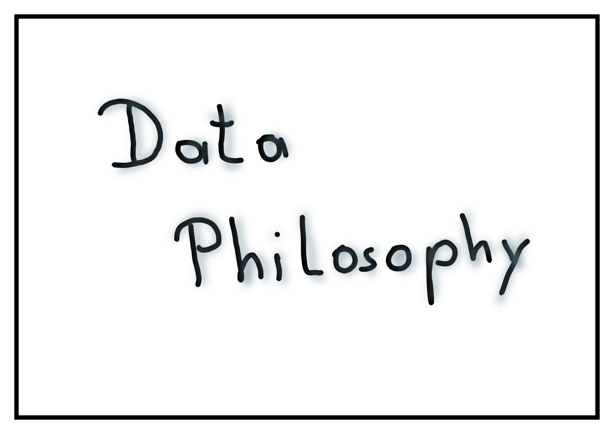

[I work](https://www.linkedin.com/in/mjaeugster/) in a *Data Analytics & Insights* unit,
in 
[my Meetup profile](https://www.meetup.com/4laendereck-Data-Science-Meetup/members/209552468/)
I state that *"I try to turn data into insights"* and in my working
day I often shout out that *"we need to create (actionable) insights and
be data-driven"* -- but what does this actually mean? This post is
part of my 
[Data Philosophy series](https://medium.com/@mjaeugster/data-philosophy-4522529ac213)
where I try to
dissect and understand what "*to turn data into insights*" actually 
means. 

# Conversion tests

